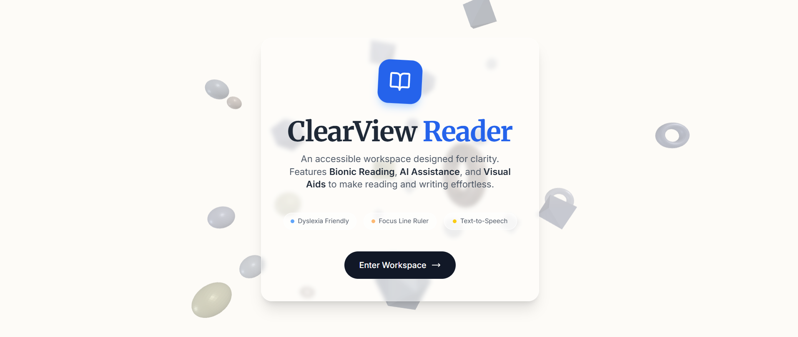
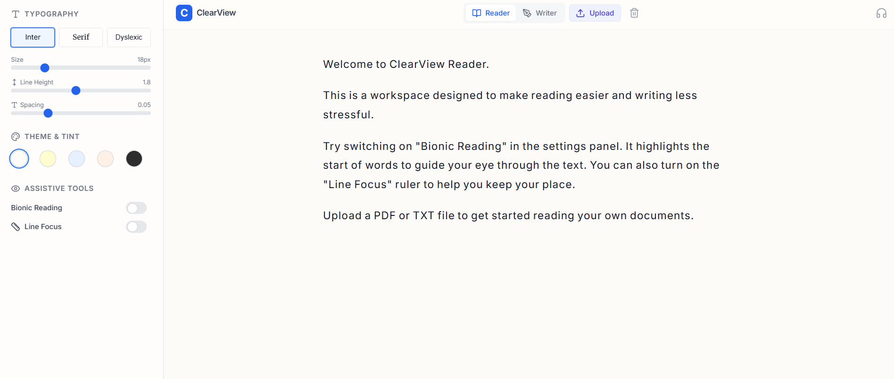

# 📘 ClearView Reader

**An accessible, AI-powered workspace designed for clarity and focus.**

ClearView Reader is a web application built to assist users with Dyslexia, ADHD, and visual stress. It creates a customizable environment for reading and writing, leveraging Google's Gemini API for cognitive support and the Web Speech API for auditory reinforcement.

<div align="center">
  
  
</div>

## ✨ Key Features

### 📖 Reader Mode (Visual Assistance)
- **Bionic Reading:** Automatically highlights the initial letters of words to guide the eye and improve reading speed.
- **Custom Typography:** Switch between Sans-Serif (Inter), Serif (Merriweather), and **OpenDyslexic** fonts.
- **Line Focus Ruler:** A digital guide that follows the mouse cursor to isolate lines of text.
- **Color Tints:** Reduces visual stress (Irlen Syndrome) with Cream, Peach, Blue, and Dark themes.
- **File Support:** Upload and process **PDF** and **TXT** documents with smart layout preservation.

### 🎧 Listener Mode (Auditory Support)
- **Text-to-Speech:** Built-in player with adjustable speed (0.75x - 1x).
- **Real-time Highlighting:** Highlights words as they are spoken to improve word recognition.

### ✍️ Writer Mode (Cognitive Support)
- **AI Simplification:** Uses **Google Gemini** to rewrite complex text into active voice and simpler sentence structures.
- **Gentle Grammar Fix:** Corrects spelling and grammar without harsh visual indicators.

## 🛠️ Tech Stack

- **Framework:** [React 19](https://react.dev/) & [Next.js](https://nextjs.org/)
- **Styling:** [Tailwind CSS](https://tailwindcss.com/)
- **AI Integration:** [Google Gemini API](https://ai.google.dev/)
- **3D Graphics:** [Three.js](https://threejs.org/) (Interactive background)
- **PDF Processing:** [PDF.js](https://mozilla.github.io/pdf.js/)
- **Icons:** [Lucide React](https://lucide.dev/)

## 🚀 Getting Started

1. **Clone the repository**
   ```bash
   git clone https://github.com/yourusername/clearview-reader.git
   ```

2. **Install dependencies**
   ```bash
   npm install
   ```

3. **Set up Environment Variables**
   Create a `.env` file in the root directory and add your Gemini API key:
   ```env
   API_KEY=your_google_gemini_api_key
   ```

4. **Run the development server**
   ```bash
   npm start
   ```

## 🎨 Accessibility First
This project follows WCAG 2.1 guidelines, ensuring high contrast ratios, screen reader compatibility, and keyboard navigability.

---

*Created by [Your Name]*